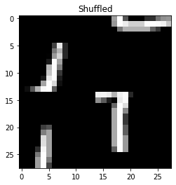

# Heatmap-style-Jigsaw-with-mnist
This repository contains the implement of Learning Heatmap-Style Jigsaw Puzzle presented by [Kun Zhang](https://arxiv.org/abs/2012.07101) for the purpose of 2D-pose estimation in human beings.

This repository provides a frame work to create this implementation

# Overview

The repository includes a ```model-utils.py``` which contains the model architecture. The ```utils.py``` file contains the functions to generate confidence maps and shuffle images. 

The purpose of this program is to divide images into patches and shuffle them, and to see if a u-net can learn the necessary spatial features to reconstruct the shuffled image.

# Concept

The program uses the example of 4 image patches which is used to test whether an image's spatial features can be learned. By using the ```plot_shuffle()``` function, the mnist image is divided into patches and shuffled.

<p align ="center">
  
</p>

