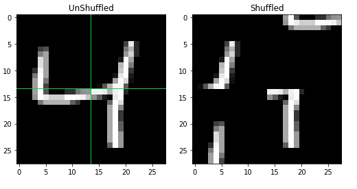
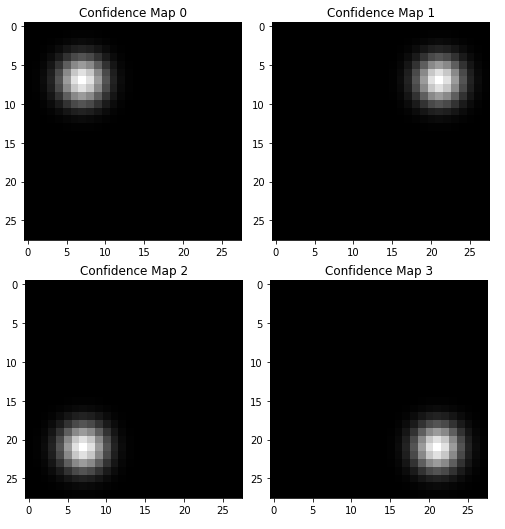
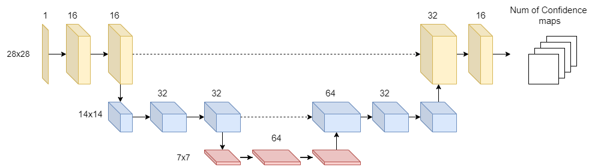

# Heatmap-Style Jigsaw Applied to Mnist
This repository contains the implementation of Heatmap-Style Jigsaw Puzzle presented by [Kun Zhang et al.2020](https://arxiv.org/abs/2012.07101) for the purpose of 2D-pose estimation in human beings.

This repository provides a framework to create this implementation with the MNIST dataset.

## Overview

The repository includes a ```model-utils.py``` which contains the model architecture. The ```utils.py``` file contains the functions to generate confidence maps and shuffle images. 

The purpose of this program is to divide images into patches and shuffle them, and to see if a u-net can learn the necessary spatial features to reconstruct the shuffled image.

## Concept

The program uses the example of 4 image patches which is used to test whether an image's spatial features can be learned. By using the ```plot_shuffle()``` function, the mnist image is divided into 4 patches and shuffled.

<p align ="center">
  
</p>

Each patch corresponds to particular confidence maps, where each confidence map represents the spatial position of each patch. For example, patch 1 corresponds to map 0 as the top left patch is located in the top left:

<p align ="center">
  
</p>

Using this principle, a simple unet was trained whose architecture is as follows:

<p align ="center">
  
</p>

After training for 20 epochs, the model was tested with the ```reassembler()``` (sanity check which reassembles the image based on the confidence maps), and showed that every shuffled image within the dataset could be reassembled: 

<p align ="center">
  
</p>

# References

[1] Zhang, K., Wu, R., Yao, P., Deng, K., Li, D., Liu, R., Yang, C., Chen, G., Du, M., &amp; Zheng, T. (2020, December 13). Learning heatmap-style jigsaw puzzles provides good pretraining for 2D human pose estimation. arXiv.org. Retrieved July 13, 2022, from https://arxiv.org/abs/2012.07101 
